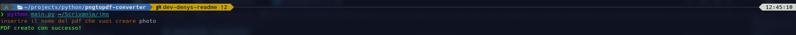

# pngtopdf-converter
### That script allow you to convert a entire folder of image PNG or JPG in a PDF file
- It include also a check if there aren't some dependency, and it tell you if it's all ok, or not during the execution of the program. 

## INSTALLATION
---
### If the script don't run because there aren't some dependency, you must run that command to install all of it.

-   <p style="color: #ff000"> Before you must change directory to the project directory! </-p>
```
    pip install --user -r dependencies/requirements.txt
```

## ECEVUTION
---
### you must have installed python on your system to run this script, afer installed it run this command in a command prompt or a terminal like CMD or Powershell in windows.

```
    python main.py path/to/img/directory
```

## CONTACT
---
<center>
  <table border=0>
    <tr>
      <td>
        <a href="https://github.com/D3ENNY">
          
        </a>
      </td>
      <td>
        <a href="mailto:denysraimondi06@gmail.com">
          
        </a>
      </td>
        <td>
          <a href="https://t.me/D3ENNY04">
            
          </a>
      </td>
    </tr>
    <tr>
      <td>github</td>
      <td>email</td>
      <td>telegram</td>
    </tr>
  </table>
</center>

## SUPPORT ME
---
If you want support me and my project you can give me a little donation at:
<center>
  <table border=0>
    <tr>
      <td>
        <a href="https://paypal.me/denysraimondi">
          
        </a>
      </td>
      <td>
        <a href="https://www.buymeacoffee.com/D3ENNY">
          
        </a>
      </td>
    </tr>
    <tr>
      <td>paypal</td>
      <td>Buy Me A Coffee</td>
    </tr>
  </table>
</center>
    
